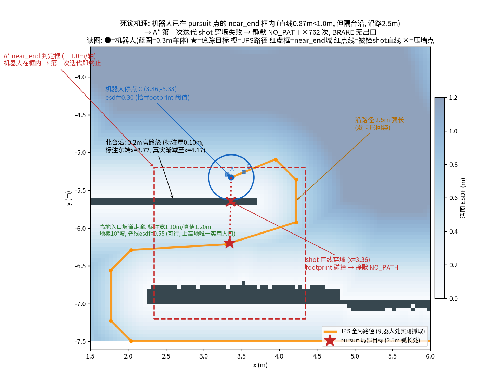
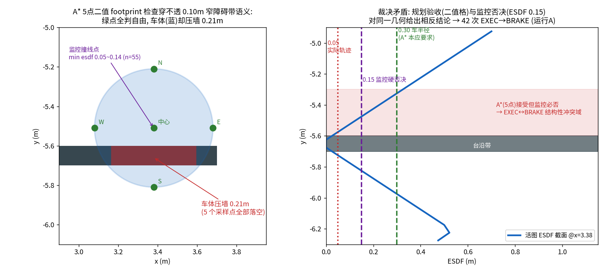
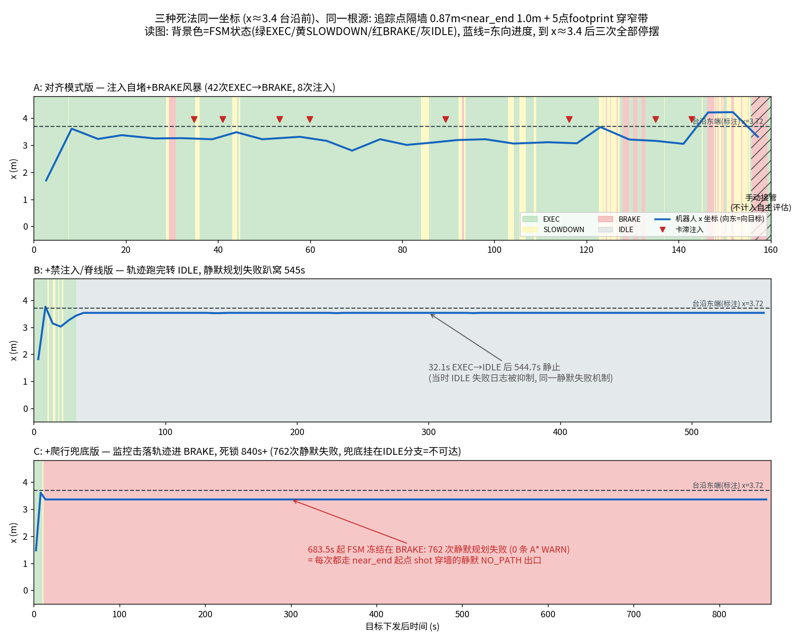
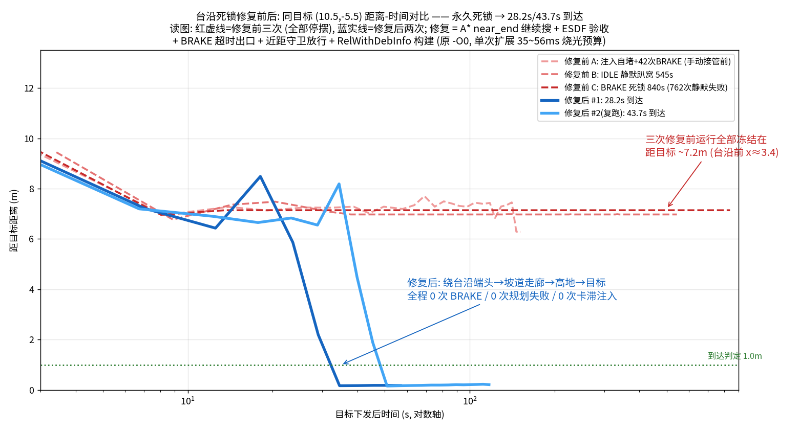

# RMUC 高地入口台沿死锁：根因取证与修复报告

- **日期**：2026-07-12
- **分支/提交**：`feat/traj-safety-monitor`，根因修复 `f029160` / `6c2f407` / `2758ad6`，取证图表 `619d326`
- **结论一句话**：机器人在高地入口台沿前永久趴窝，不是"窄道太窄"或"地图被污染"，而是**四个组件间的度量语义错配叠加一个无出口状态机**，外加全栈 `-O0` 构建放大——修复后原场景 28.2s / 43.7s 自主到达（此前三次全部死锁，最长 762 次规划失败冻结 840s+）。

---

## 1. 现象与影响

导航目标 (10.5, -5.5) 必经高地入口。三次迭代版本全部止步于同一坐标（x≈3.4，台沿前），死法各异：

| 运行 | 版本 | 死法 | 量化（日志实测） |
|---|---|---|---|
| A | 对齐模式版 | 卡滞注入自堵 + BRAKE 风暴 | 42 次 EXEC→BRAKE，8 次虚拟障碍注入全部聚在台沿前 (3.26~3.75, -5.40~-5.86)，17 次 Replan failed |
| B | +禁注入/脊线版 | 轨迹跑完转 IDLE 后静默趴窝 | 静止 **544.7s**，期间规划失败**零日志**（IDLE 失败日志被抑制） |
| C | +爬行兜底版 | 安全监控击落轨迹进 BRAKE 死锁 | **762 次** `Replan failed, state=BRAKE`，FSM 冻结 **840s+**，爬行兜底 0 次触发 |

三次运行中安全监控读到的轨迹 min-ESDF：A 撞线 48 次（中位 0.05m，含 4 次 0.00），B 4 次，C 3 次全 0.05m——全部低于硬否决阈值 0.15m。

## 2. 取证方法

四路**独立**取证并行执行，结论交叉验证，关键推断再做数学复现与源码钉死：

1. **日志法证**：三份运行日志逐事件还原（FSM 序列、位置时间线、失败计数、速度对账）；
2. **活图实测**：仿真死锁现场在线抓取 `/sdf_map/occupancy` 与 `/sdf_map/esdf`，与静态标注逐格 diff；
3. **三层几何对照**：Gazebo 世界 mesh（真值）↔ 静态标注 PGM ↔ 活图，建立 world→odom 变换后逐项对齐；
4. **代码路径审计**：planToGoal / A* / FSM / 兜底的全部失败出口枚举（file:line 级）。

决定性实验：现场重抓 JPS 全局路径 → 按源码算法复现 pursuit 点 → 数值验证 near_end 判定与 shot 穿墙 → A* 源码逐行确认静默出口。修复设计另做了一轮对抗性审查（发现两处设计稿遗漏，见 §5）。

## 3. 现场几何真相（三层对照）

**先纠正问题定义**：此处不存在"0.8m 窄缝"。真实结构（Gazebo mesh 实测，标注/活图偏差 ≤6cm）：

- **北侧**：0.203m 高路缘台沿（竖壁在 odom y=-5.65），标注为 0.10m 厚占据带（y∈[-5.70,-5.60]），标注东端 x=3.72，真值渐减到 x=4.17（7cm→0 残沿，标注未画但点云可见）；
- **南侧**：0.15m 薄墙（高出地面 0.403m）；
- **两者之间**：高地入口坡道走廊，真实净宽 **1.20m**（标注 1.10m，活图 1.05m——均为栅格化正常公差），地板为 **10.0° 斜坡**，走廊中线 ESDF 脊线 0.55m——对 0.6m 车宽、验收 0.3m 的要求**完全可通**；
- 该走廊是上高地的**唯一实用入口**（东侧坡道仅 0.70m 宽，余量 0.05m 更差；绕行多走 13~14m）。

**活图质量无罪**：全 ROI（x∈[2,5], y∈[-7,-4]）活图 vs 标注差异仅 36 格，100% 为南墙顶面亚分辨率网格套准（两网格系 ~2cm 原点偏移），零独立斑块、零幽灵、零贴口加厚。



## 4. 根因链（每环均有源码/数据双重证据）

### 环 1：弧长 pursuit vs 欧氏 near_end 的语义错配

局部目标取 JPS 路径前方 **2.5m 弧长**处（`pursuitPointOnPath`）。JPS 路径在台沿处发卡回绕（绕端头→折返穿走廊），实抓路径复现计算：pursuit 点落在 **(3.34, -6.20)**——沿路 2.5m，**直线距机器人仅 0.871m，且隔着台沿**。

A* 的 near_end 判定是索引切比雪夫距离 ≤ `ceil(1/resolution)`=20 格 = **1.0m/轴**（`kinodynamic_astar.cpp` L104, L114-115）。Δ=(0.4, 17.4) 格 → 机器人起点**在第一次循环迭代就被判"已近目标"**。

### 环 2：A* 的静默失败出口

起点 near_end → `computeShotTraj` 直线打向目标 → 直线在 x≈3.36 处横穿台沿带（三处 y 交点全部落在占据带内，数值验证）→ footprint 碰撞 → `parent==NULL` → **`return NO_PATH`，零节点扩展、零日志**（修复前 L141-155）。

日志指纹完全吻合：762 次失败中，A* 两个有声出口（`open set empty` / `run out of memory`）均为 **0 次**。

### 环 3：5 点二值 footprint 穿薄障碍 → 规划/监控裁决矛盾

A* 扩展与 shot 的碰撞检查为"中心 + 4 个轴向 ±0.3m 采样点查二值占据格"。0.10m 薄带恰好从采样点间穿过——监控撞线点 (3.38,-5.51) 处几何验证：**5 个采样点全部落在自由格，而车体圆盘压占据带 0.21m**。

规划器（二值 5 点）接受、监控（连续 ESDF，硬否决 0.15m）必否——对同一几何给出相反裁决，这是运行 A 42 次 EXEC↔BRAKE 振荡的直接来源，也是机器人得以开到"距台沿 0.05m"从而触发后续死锁的原因。



### 环 4：BRAKE 无失败出口 + 兜底死代码

FSM 中 BRAKE 仅有 `PLAN_SUCCESS` / `GOAL_REACHED` 两个出口；`PLAN_FAIL` 与 `TRAJ_FINISHED` 均保持 BRAKE（`planner_fsm.hpp` L47-54）。规划连败 → 永久死锁。窄道爬行兜底只挂在 controlLoop 的 `case IDLE` 分支——对 BRAKE 死法**结构性不可达**（0 次触发的真因）。附带发现：BRAKE 下轨迹恒空，`GOAL_REACHED` 在轨迹结束代码路径里实际不可达，仅是转移表上的纸面出口。



### 环 5（修复验收中暴露）：全栈 -O0 构建

首轮修复验收失败，新加的阶段归因日志直接给出 `A* no path (time budget): iters=1, 35~56ms`——colcon 默认构建**不带任何优化标志**（实测 `flags.make` 的 CXX_FLAGS 无 `-O`），A* 单次 init 扩展（500 primitive × 50 采样）就烧光整个搜索预算。全栈（A*/ESDF/MINCO/LIO）一直运行在 -O0。

### 已排除的假设（负结果）

- ✗ "活图配准噪声把缝压窄"——活图与标注仅差 36 格亚分辨率套准（§3）；
- ✗ "运行 A 中 x=6.08 是 LIO 跳变"——日志对账证明是手动目标驱动的真实运动（手动接管始于 1783855982.7，早于原认知 17s；分段速度 0.33~0.72 m/s 均物理可行，全日志无时间戳回退、无重定位）。

## 5. 修复设计与实现

设计原则：**跨组件度量语义对齐、验收严于监控、吸收态必须有失败出口、失败必须有声**。对抗性设计审查额外抓出两处（均已修复）：`planToGoal` 的 `diff<1.0m → SKIPPED` 守卫会让修好的 A* 在原场景根本不被调用；`getSamples` 在无 shot 分支把**起点**速度当**终点**速度喂给 MINCO。

| 修复 | 提交 | 要点 |
|---|---|---|
| A* near_end 不再静默放弃 | `f029160` | shot 失败继续扩展绕行；搜索耗尽时返回"先过 0.4m 推进门槛再取距目标最近"节点的部分路径 (NEAR_END) |
| ESDF 验收替代 5 点 footprint | `f029160` | `getDistance ≥ accept_clearance`(0.28 = robot_radius − res/2)，扩展与 shot 同判据，保留起点豁免；阈值链 0.28 > warn 0.20 > hard 0.15 |
| 失败出口有声 | `f029160`/`6c2f407` | A* 全部 NO_PATH 出口带原因枚举与两端坐标/ESDF；planToGoal 三级阶段归因（A*/采样/MINCO） |
| getSamples 末速 bug | `f029160` | 末速取路径末节点（原为起点） |
| BRAKE_SETTLED 出口 | `6c2f407` | 刹停静置 1.0s 且 v<0.1 → IDLE；IDLE 分支补僵尸目标清理 |
| 近距守卫放行 | `6c2f407` | `diff<1.0m` 仅在有轨迹执行时 SKIPPED |
| 爬行兜底可达化 | `6c2f407` | 触发=窄区 esdf<0.55 或连败≥5 且全局路径在；对齐模式禁卡滞注入；前瞻点 ESDF 脊线纠偏 |
| 构建启用优化 | `2758ad6` | `podman-dev.sh build` 加 `-DCMAKE_BUILD_TYPE=RelWithDebInfo`；搜索预算 40ms |

新增参数：`search.accept_clearance`(0.28)、`search.max_search_time_ms`(40)、`search.near_end_min_progress`(0.4)、`safety.brake_settle_time`(1.0)、`safety.brake_settle_vel`(0.1)、`replan.crawl_fail_threshold`(5)。

## 6. 验收

单元测试 46 例全绿，其中新增：A* 6 例（走廊直行 / 薄带永不穿透 / **死锁几何复刻**（绕台沿端头成功）/ 不可达限时 / 起点豁免 / 末速回归）、FSM 2 例、追踪器 2 例。

整机（原死锁场景，goal (10.5,-5.5)，无人工干预）：

| 指标 | 修复前（三次） | 修复后（三次） |
|---|---|---|
| 到达 | 0/3（全部死锁） | **3/3**（28.2s / 43.7s，返程 22.1s） |
| EXEC↔BRAKE | 最多 42 次 | **0 次** |
| 规划失败 | 最多 762 次（静默） | **0 次** |
| 卡滞注入 | 8 次（自堵） | 0 次 |
| 路线 | 冻结于 x≈3.4 | 绕台沿端头→坡道走廊→高地→目标 |



**未整机验证**（诚实声明）：幽灵格注入恢复时限（机制有单测与 occ_timeout 兜底）；0.70m 东坡道通行；坡道模式仅间接验证（路线含 10° 坡，无异常）。

## 7. 可迁移的经验教训

1. **跨组件的"距离/接近"必须统一语义**：弧长（pursuit）、欧氏/索引（near_end）、二值格（footprint）、连续 ESDF（监控）四种度量在同一条链上各说各话，死锁产生于边界而非任何单个组件内部。
2. **验收与否决的阈值链方向必须一致**：规划器验收要严于监控否决（0.28 > 0.20 > 0.15），否则"规划器造监控必杀的轨迹"结构性振荡。（此前教训的反向案例：上次是监控严于验收，这次是验收松于监控——两个方向都会炸。）
3. **状态机吸收态必须有失败出口**：只靠"成功"退出的状态，在成功不可能时就是死锁。
4. **失败出口必须有声**："0 条 WARN"这次成了破案指纹——本应是第一天就有的日志。545s 无日志静止的诊断成本远高于几行 throttled WARN。
5. **性能结论前先确认构建类型**：`grep CXX_FLAGS build/<pkg>/CMakeFiles/*/flags.make`。-O0 与"算法慢"症状相同；任何 time-budget 参数必须在目标构建类型下标定。
6. **采样式碰撞检查的密度必须匹配最薄障碍**：采样间距 0.3m 对 0.10m 台沿/围栏类障碍必然漏检；连续场（ESDF）判定天然免疫。

## 8. 遗留与建议

- **标注缺口（建议尽快补）**：x∈[6.5,12.4] 段高地南沿在标注图上完全未画，Gazebo 真值该处有 0.2m 台阶 + 10.7° 坡带——JPS 可能在先验图上规划直穿物理台阶。台沿东端标注止于 3.72（真值渐减至 4.17），动态层可见，可不修。
- ESDF 验收（0.28m 排斥半径）对单格幽灵障碍比旧 5 点检查敏感：1.10m 走廊中线出现一个幽灵格即临时封路。既有缓解链：`normal_count_thresh=2` 挡稀疏噪声、`occ_timeout=3.5s` 自愈、爬行兜底（其硬保护仅要求 0.15）。建议实车阶段补幽灵注入恢复时限的整机测试。
- 爬行兜底在修复后的三次验收中 0 次触发（A* 成功率 100%）——它现在是保险丝而非主通路，符合设计意图。

## 附录：复现方法

```bash
# 环境: podman + ROS Jazzy (scripts/podman-dev.sh), RelWithDebInfo 构建
./scripts/podman-dev.sh build && ./scripts/podman-dev.sh bringup

# 原死锁场景验收 (发目标+记录, 180s)
podman exec <bringup容器> bash -c "source /opt/ros/jazzy/setup.bash && \
  source /workspace/sentry_nav_26/install/setup.bash && export RMW_IMPLEMENTATION=rmw_zenoh_cpp && \
  python3 /workspace/sentry_nav_26/scripts/diag/tracking_recorder.py /tmp/run 10.5 -5.5 180"

# 关键日志指纹
grep -oE "FSM: [A-Z]+ -> [A-Z]+" <bringup日志> | sort | uniq -c   # 期望: 仅 IDLE<->EXEC
grep -cE "A\* no path|Plan stage"  <bringup日志>                   # 期望: 0

# 单测
./scripts/podman-dev.sh test   # path_searching: test_kinodynamic_astar (死锁几何复刻用例)
```

死锁几何单测复刻（`src/path_searching/test/test_kinodynamic_astar.cpp` · `DeadlockGeometryGoesAround`）：占据带 y∈[-5.69,-5.59]、东端 x=3.70，起点 (3.36,-5.33)，目标 (3.34,-6.20)——修复前必静默 NO_PATH，修复后绕端头到达。
